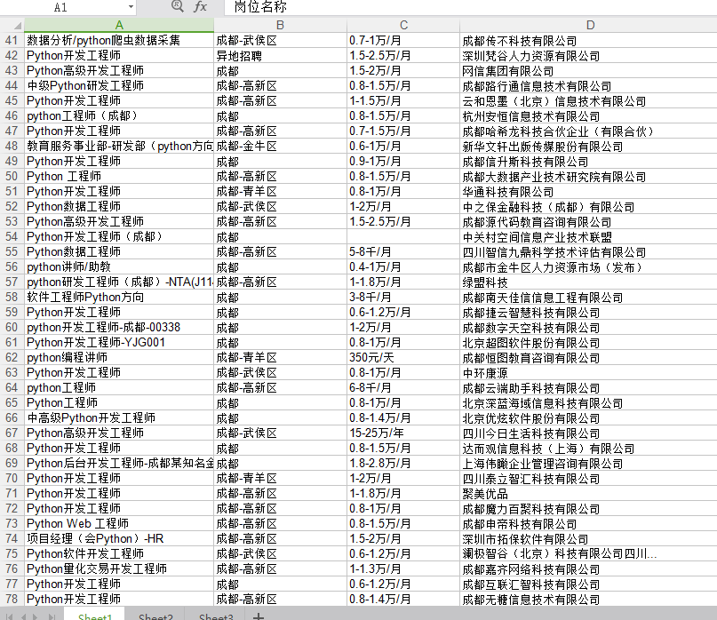
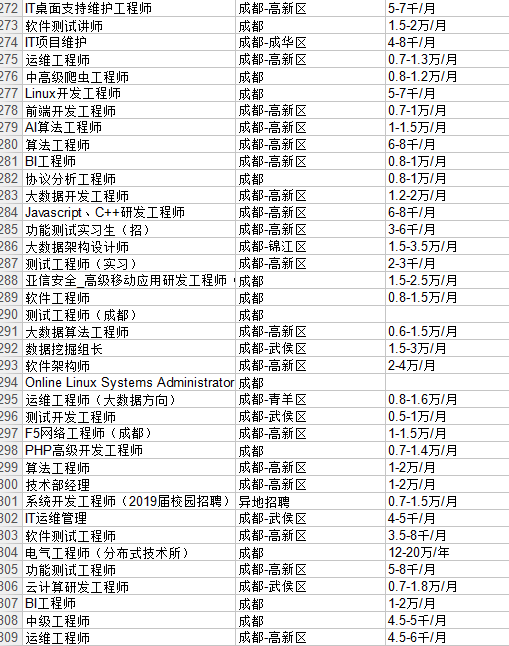

# 爬取前程无忧招聘信息

这是本人爬取成都地区,python相关的招聘信息保存到Excel中的部分截图






工具: selenium + lxml + xlrd + xlutils(后面两者的作用主要是将数据保存到Excel中)

源码:

```
from selenium import webdriver
from selenium.common.exceptions import TimeoutException
from selenium.webdriver.common.by import By
from selenium.webdriver.support.ui import WebDriverWait
from selenium.webdriver.support import expected_conditions as EC
from lxml import etree
from xlrd import open_workbook
from xlutils.copy import copy

browser = webdriver.Chrome()
browser.set_window_size(1400, 700)
wait = WebDriverWait(browser, 10)
# 爬取职位的关键字,可以换成其他的比如: 服务员,项目经理,收银员等等
KEYWORD = 'python'


def save_data(data):
    """
    以追加的方式,将数据保存到Excel中
    """
    rexcel = open_workbook("data/jobs.xlsx", encoding_override='utf-8')  # 用wlrd提供的方法读取一个excel文件
    try:
        rows = rexcel.sheets()[0].nrows  # 用wlrd提供的方法获得现在已有的行数
    except:
        rows = 0
    excel = copy(rexcel)  # 用xlutils提供的copy方法将xlrd的对象转化为xlwt的对象
    table = excel.get_sheet(0)  # 用xlwt对象的方法获得要操作的sheet
    row = rows
    table.write(row, 0, data['name'])  # xlwt对象的写方法，参数分别是行、列、值
    table.write(row, 1, data['addr'])
    table.write(row, 2, data['pay'])
    table.write(row, 3, data['company'])
    table.write(row, 4, data['date'])
    excel.save("data/jobs.xlsx")  # xlwt对象的保存方法，这时便覆盖掉了原来的excel


def index_page(page):
	"""
	获取招聘列表页面
	"""
    try:
        url = 'https://search.51job.com/list/090200,000000,0000,00,9,99,' + KEYWORD + ',2,1.html?lang=c&stype=1' \
              '&postchannel=0000&workyear=99&cotype=99&degreefrom=99&jobterm=99' \
              '&companysize=99&lonlat=0%2C0&radius=-1&ord_field=0&confirmdate=9' \
              '&fromType=&dibiaoid=0&address=&line=&specialarea=00&from=&welfare='
        browser.get(url)

        browser.execute_script('window.scrollTo(0, document.body.scrollHeight)')
        if page > 1:
            input = wait.until(
                EC.presence_of_element_located((By.CSS_SELECTOR, '#jump_page')))
            submit = wait.until(
                EC.element_to_be_clickable((By.CSS_SELECTOR, '#resultList .dw_page .og_but')))
            input.clear()
            input.send_keys(page)
            submit.click()
    except TimeoutException:
        index_page(page)
    page_source = browser.page_source
    return page_source


def parse_page(page_source):
	"""
	解析页面信息
	"""
    etree_html = etree.HTML(page_source)
    products = etree_html.xpath('//div[@id="resultList"]//div[@class="el"]')

    for product in products:
        item = {}
        item['name'] = product.xpath('.//a/text()')[0].strip()
        item['addr'] = product.xpath('.//span[@class="t3"]/text()')[0].strip()
        try:
            item['pay'] = product.xpath('.//span[@class="t4"]/text()')[0].strip()
        except:
            item['pay'] = ''
        item['company'] = product.xpath('.//span[@class="t2"]/a/text()')[0].strip()
        item['date'] = product.xpath('.//span[@class="t5"]/text()')[0]
        yield item


def main():
    for page in range(10):
        page_source = index_page(page + 1)
        products = parse_page(page_source)
        for product in products:
            save_data(product)


if __name__ == '__main__':
    main()

```

