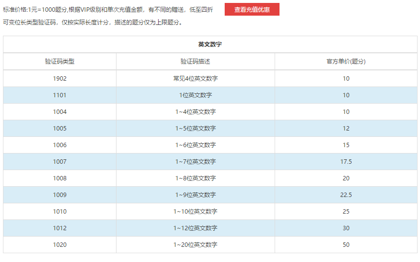
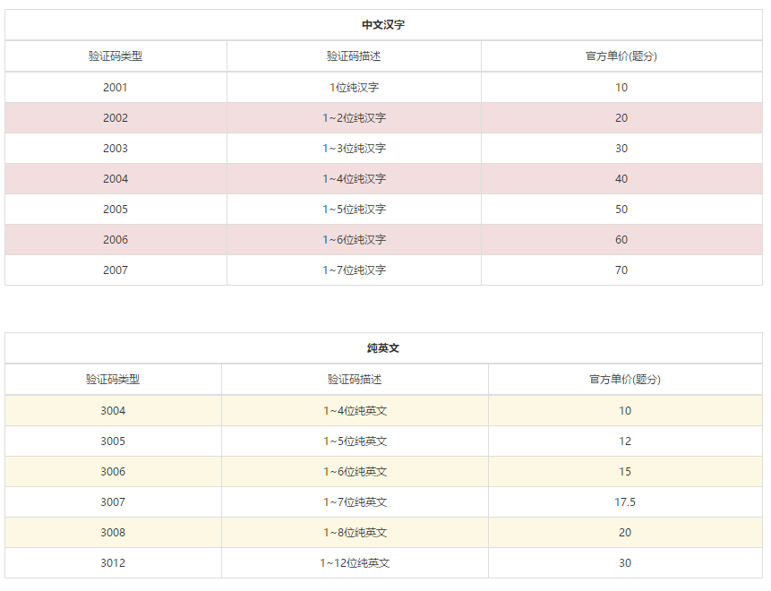
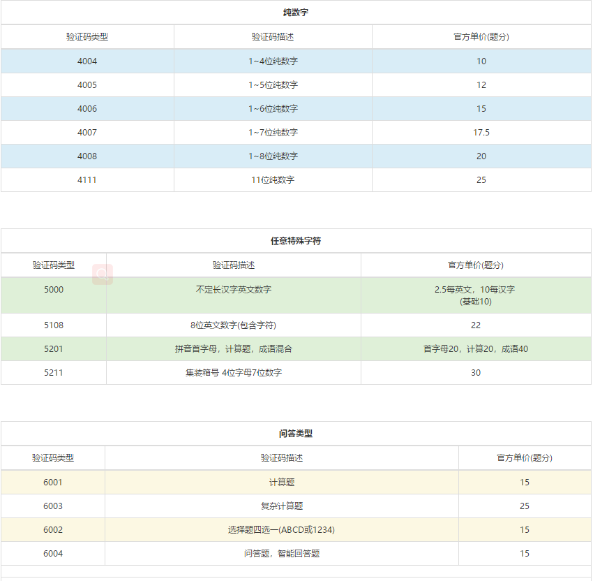
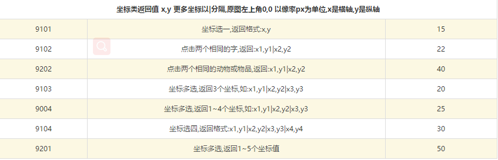
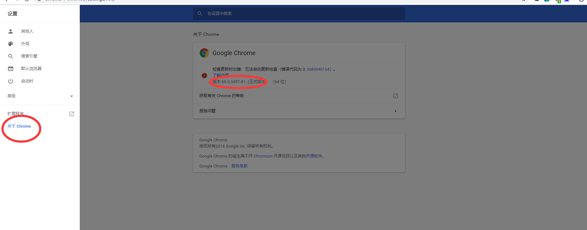
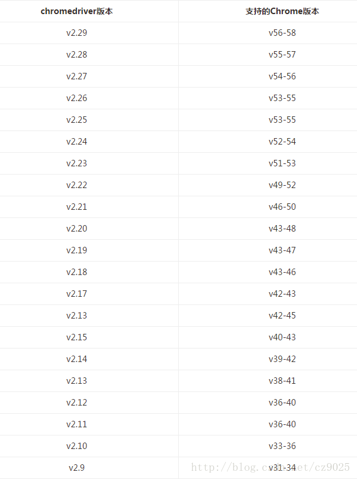
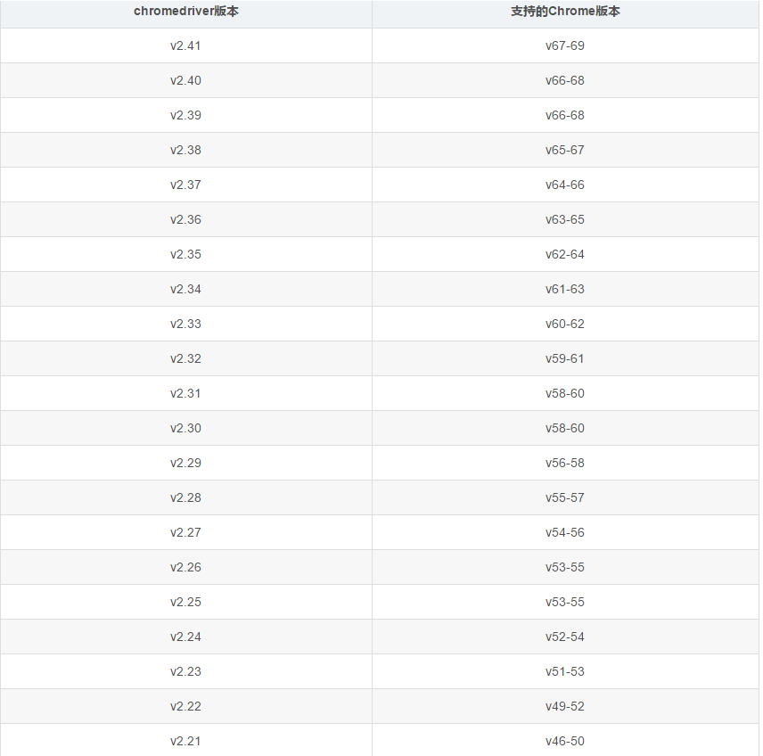

# 破解普通验证码

先上本文破解的三张验证码图片:


现在进入正题,本文主要介绍的其实是一个叫超级鹰的收费工具,它提供了图片验证码的识别,并把结果返回给我们.

[超级鹰官网]: http://www.chaojiying.com/

概要步奏:

​	1.从网页上获取到验证码的图片(根据本人经验,最好采用浏览器截图的方式去获取并保存图片)

​	2.调用超级鹰的接口,将图片传入,然后获取超级鹰返回的字符串结果

```
# 不同的验证码图片,返回的格式不一样, 比如上面前第一张验证码图片
{'err_no': 0, 'err_str': 'OK', 'pic_id': '6044217171769300002', 'pic_str': '6NW3', 'md5': '248dbca26ce9ab107fb9c1334befa9ae'}
# 而最后一张返回的就是,文字在图片的位置的水平和垂直坐标,并且不同文字的坐标用|分开
{'err_no': 0, 'err_str': 'OK', 'pic_id': '6044217151769300001', 'pic_str': '243,278|105,224|147,143', 'md5': '22db3669aba467ab6891d6e4e96b8095'}

```

​	返回的字典的 pic_str 就是我们需要的字符串数据

​	3.将字符串按需求处理后,将结果填入即可

下面附上超级鹰的api配置(python3, 其他语言的可以在官网上查看)

```
import requests
from hashlib import md5


class Chaojiying_Client(object):
	"""
	username  注册的超级鹰用户名
	password  注册的超级鹰用户密码
	soft_id   软件id,需要用户自己在官网生成
	"""
    def __init__(self, username, password, soft_id):
        self.username = username
        password =  password.encode('utf8')
        self.password = md5(password).hexdigest()
        self.soft_id = soft_id
        self.base_params = {
            'user': self.username,
            'pass2': self.password,
            'softid': self.soft_id,
        }
        self.headers = {
            'Connection': 'Keep-Alive',
            'User-Agent': 'Mozilla/4.0 (compatible; MSIE 8.0; Windows NT 5.1; Trident/4.0)',
        }

    def PostPic(self, im, codetype):
        """
        im: 图片字节
        codetype: 题目类型 参考 http://www.chaojiying.com/price.html
        """
        params = {
            'codetype': codetype,
        }
        params.update(self.base_params)
        files = {'userfile': ('ccc.jpg', im)}
        r = requests.post('http://upload.chaojiying.net/Upload/Processing.php', data=params, files=files, headers=self.headers)
        return r.json()

    def ReportError(self, im_id):
        """
        im_id:报错题目的图片ID
        """
        params = {
            'id': im_id,
        }
        params.update(self.base_params)
        r = requests.post('http://upload.chaojiying.net/Upload/ReportError.php', data=params, headers=self.headers)
        return r.json()


if __name__ == '__main__':
    chaojiying = Chaojiying_Client('账号名', '密码', '软件ID') # 需要用户账号里面有题分
    im = open('图片名', 'rb').read()
    result = chaojiying.PostPic(im, 识别的图片类型ID) # 图片识别的类型ID,可以根据自己的需求在超级鹰官网上找到验证码类型代码:
```

超级鹰图片识别的类型ID以及对应消耗的题分截图:









下面是本人就超级鹰注册来示范简单的验证码破解代码:

* 注意代码中用到了webdriver,需要下载与Chrome版本对应的chromedriver.exe

* Chrome版本在浏览器设置里面可以见(本人是69版本的)

  

  然后去

  [淘宝镜像]: https://npm.taobao.org/mirrors/chromedriver

  下载对应版本的chromedriver.exe

  

  

* 然后配置path环境,将chromedriver.exe路径放在环境最前面,就可以进行浏览器自动化了

```
import time
from random import randint

from io import BytesIO
from PIL import Image
from selenium import webdriver
from selenium.common.exceptions import TimeoutException
from selenium.webdriver.common.by import By
from selenium.webdriver.support.ui import WebDriverWait
from selenium.webdriver.support import expected_conditions as EC

from utils.chaojiying import Chaojiying_Client

# 启动浏览器
browser = webdriver.Chrome()
# 调整浏览器窗口大小
browser.set_window_size(800, 800)
# 设置浏览器等待加载元素的时间
wait = WebDriverWait(browser, 10)
# 以下是网页需要填写的内容,
USER = '96588kh'
PASSWORD = '965478685'
QQ = '106364895'
EMAIL = QQ + '@qq.com'
PHONE = '13788664596'


def get_image_code(filename):
    chaojiying = Chaojiying_Client('carmack', 'Vff635241', '96001')
    im = open(filename, 'rb').read()
    return chaojiying.PostPic(im, 1902)


def index_page():
    try:
        url = 'http://www.chaojiying.com/user/reg/'
        browser.get(url)
        # 以下获取输入框元素
        username = wait.until(
            EC.presence_of_element_located((By.NAME, 'user'))
        )
        psd = wait.until(
            EC.presence_of_element_located((By.NAME, 'pass'))
        )
        pass2 = wait.until(
            EC.presence_of_element_located((By.NAME, 'pass2'))
        )
        email = wait.until(
            EC.presence_of_element_located((By.NAME, 'email_reg'))
        )
        qq = wait.until(
            EC.presence_of_element_located((By.NAME, 'qq'))
        )
        mobile_phone = wait.until(
            EC.presence_of_element_located((By.NAME, 'mobile_phone'))
        )
        imgtxt = wait.until(
            EC.presence_of_element_located((By.NAME, 'imgtxt'))
        )

        img = wait.until(
            EC.presence_of_element_located((By.XPATH, '//form//img'))
        )
        # 截取浏览器窗口
        screenshot = browser.get_screenshot_as_png()
        screenshot = Image.open(BytesIO(screenshot))
        time.sleep(2)
        # 获得验证码元素的位置
        location = img.location
        # 获得验证码图片的大小
        size = img.size
        top, bottom, left, right = location['y'], location['y'] + size['height'], location['x'], location['x'] + size[
            'width']
        # 截取验证码图片
        captcha = screenshot.crop((left, top, right, bottom))
        # 保存验证码图片
        filename = 'images/codes/' + str(randint(10000000, 1000000000)) + '.png'
        captcha.save(filename)
		# 调用超级鹰验证码接口,接口部分在本文前面
        code = get_image_code(filename)
        # 填写值
        username.send_keys(USER)
        psd.send_keys(PASSWORD)
        pass2.send_keys(PASSWORD)
        email.send_keys(EMAIL)
        qq.send_keys(QQ)
        mobile_phone.send_keys(PHONE)
        imgtxt.send_keys(code['pic_str'])
        sublime = wait.until(
            EC.element_to_be_clickable((By.CSS_SELECTOR, 'button.signup_button'))
        )
        time.sleep(3)
        # 点击注册
        sublime.click()
    except TimeoutException:
    # 如果加载元素超时,便重新访问网页
        index_page()


def main():
    index_page()


if __name__ == '__main__':
    main()
```

