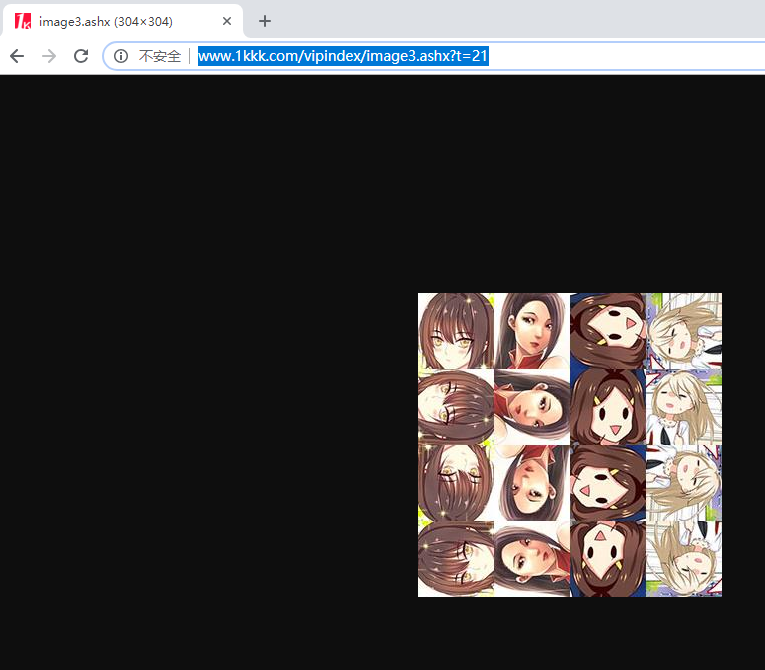

# 破解极速漫画图片旋转验证

今天给大家介绍的是暴利破解图片旋转验证:

待验证截图


已自动验证后的截图


原理:

​	1.先通过获取验证码图片的链接保存大量验证码图片

​	

2.将获取的大图片按4*4分割,只保留最上面的4张图片;

3,将保留的图片通过图像对比的方式来尽量除去重复的图片,由于图像对比的方法不能保证百分百的准确,所以还是存在很多肉眼看起来重复的图片(考虑到图片旋转一般是用在登录,所以对验证准确的要求比效率高),本人一共获取了两千多张大图片,通过去重后剩下六百多张(可能还有没获取完的图片, 可以继续获取,当然图片越多,验证花费的时间越多,但是准确率越高),本人现在验证的成功率在70%左右;

4. 通过人工的方式,将保留下来的图片按不同方向分别保存在4个文件夹中(images0 ，images1 ，images2 ，images3) ，对应上左下右四个方向的图片;

5. 登录时 ，用截图的方式将4张验证码图片分别传入验证方法验证 ，根据文件夹对应的方向来获取需要旋转的次数;

   

**源码:**

图像对比的方法可以参考网上资源

[图像对比]: (http://blog.sina.com.cn/s/blog_70cff2d70102wfgz.html)

图像对比

```
import os
from PIL import Image

def calculate(image1, image2):
    g = image1.histogram()
    s = image2.histogram()
    assert len(g) == len(s), "error"

    data = []

    for index in range(0, len(g)):
        if g[index] != s[index]:
            data.append(1 - abs(g[index] - s[index]) / max(g[index], s[index]))
        else:
            data.append(1)

    return sum(data) / len(g)


def split_image(image, part_size):
    pw, ph = part_size
    w, h = image.size

    sub_image_list = []

    assert w % pw == h % ph == 0, "error"

    for i in range(0, w, pw):
        for j in range(0, h, ph):
            sub_image = image.crop((i, j, i + pw, j + ph)).copy()
            sub_image_list.append(sub_image)

    return sub_image_list


def classfiy_histogram_with_split(image1, image2, size=(76, 76), part_size=(19, 19)):
    '''
     'image1' 和 'image2' 都是Image 对象.
     可以通过'Image.open(path)'进行创建。
     'size' 重新将 image 对象的尺寸进行重置，默认大小为256 * 256 .
     'part_size' 定义了分割图片的大小.默认大小为64*64 .
     返回值是 'image1' 和 'image2'对比后的相似度，相似度越高，图片越接近，达到100.0说明图片完全相同。
    '''
    img1 = image1.resize(size).convert("RGB")
    sub_image1 = split_image(img1, part_size)

    img2 = image2.resize(size).convert("RGB")
    sub_image2 = split_image(img2, part_size)

    sub_data = 0
    for im1, im2 in zip(sub_image1, sub_image2):
        sub_data += calculate(im1, im2)

    x = size[0] / part_size[0]
    y = size[1] / part_size[1]

    pre = round((sub_data / (x * y)), 6)
    return pre * 100


def remove_duplicate():
    n = 1
    while n < len(os.listdir('images')):
        file_names = os.listdir('images')
        flag = False
        for i in range(n + 1, len(os.listdir('images'))):
            file1 = 'images/' + str(n) + '.png'
            file2 = 'images/' + str(i) + '.png'
            if os.path.getsize(file1) == os.path.getsize(file2):
                flag = True
        if flag:
            file_names = os.listdir('images')
            t = 1
            for file_name in file_names:
                image = Image.open('images/' + file_name)
                image.save('images/' + str(t) + '.png')
                t += 1


if __name__ == '__main__':
    image1 = Image.open("images/551.png")
    image2 = Image.open("images/573.png")
    result = classfiy_histogram_with_split(image1, image2)
    print(result)
```

获取图片

```
import os
import time

import requests
from PIL import Image

from utils import classfiy_histogram_with_split


def check_image(n):
    file_names = []
    file_names = os.listdir('images')
    image1 = Image.open('images/' + str(n) + '.png')
    if len(file_names) > 0:
        for i in range(1, n):
            file_name = 'images/' + str(i) + '.png'
            image2 = Image.open(file_name)
            # 图片相似程度1-100(数字越大,图片越相似, 100表示完全相同)
            similarity = classfiy_histogram_with_split(image2, image1)
            # 考虑图片比较多,所以设置相似为55以上便判断为相同
            if similarity > 55:
                return True
    return False


def get_image(n):
    url = 'http://www.1kkk.com/vipindex/image3.ashx?t=' + str(int(time.time()))
    response = requests.get(url)
    n += 1
    if response.status_code == 200:
        images = response.content
        cut_image(images, n)


def cut_image(images, n):
    with open('checkImage.png', 'wb') as f:
        f.write(images)
    for i in range(4):
        img = Image.open('checkImage.png')
        # 截取四张小图
        img1 = img.crop((i * 76, 0, (i + 1) * 76, 76))
        file_name = 'images/' + str(n) + '.png'
        img1.save(file_name)
        if not check_image(n):
            print(n)
            n += 1
        else:
            os.remove(file_name)


def main():
    n = 0
    while n < 2000:
        print(f'请求第{n}次')
        file_names = []
        file_names = os.listdir('images')
        get_image(len(file_names))
        print(f'总图片数量:{len(file_names)}')
        n += 1


if __name__ == '__main__':
    main()
```

登录验证

```
import os
import time

from io import BytesIO

from PIL import Image
from selenium import webdriver
from selenium.webdriver.common.by import By
from selenium.webdriver.support.ui import WebDriverWait
from selenium.webdriver.support import expected_conditions as EC

from day6.get_code import get_image_code

# 用户名
USER = 'username'
# 用户密码
PASSWORD = 'password'


class CrackGeetest():
    def __init__(self):
        self.url = 'http://www.1kkk.com/vipindex/'
        self.browser = webdriver.Chrome()
        self.browser.set_window_size(1600, 800)
        self.wait = WebDriverWait(self.browser, 10)
        self.email = USER
        self.password = PASSWORD

    def open(self):
        self.browser.get(self.url)
	
    def get_login_button(self):
        """
        点击弹出登录窗口的按钮
        """
        time.sleep(2)
        button = self.wait.until(
            EC.element_to_be_clickable((By.XPATH, '/html/body/section[2]/div/div/div[1]/a')))
        return button

    def get_login_input(self):
        email = self.wait.until(
            EC.presence_of_element_located((By.XPATH, '/html/body/section[3]/div/div/div/div/p[2]/input')))
        password = self.wait.until(
            EC.presence_of_element_located((By.XPATH, '/html/body/section[3]/div/div/div/div/p[3]/input')))
        email.send_keys(self.email)
        password.send_keys(self.password)

    def get_geetest_image(self, name='captcha.png', id=1):
        """
        获取验证码图片
        :return: 图片对象
        """
        top, bottom, left, right = self.get_position(id)
        screenshot = self.get_screenshot()
        captcha = screenshot.crop((left, top, right, bottom))
        captcha.save(name)

    def get_screenshot(self):
        """
        获取网页截图
        :return: 截图对象
        """
        screenshot = self.browser.get_screenshot_as_png()
        screenshot = Image.open(BytesIO(screenshot))
        return screenshot

    def get_position(self, id=1):
        """
        获取验证码位置
        :return: 验证码位置元组
        """
        img = self.get_image_element(id)
        location = img.location
        size = img.size
        top, bottom, left, right = location['y'], location['y'] + size['height'], location['x'], location['x'] + size[
            'width']
        return (top, bottom, left, right)

    def get_image_element(self, id):
    	"""
    	获取四张验证码图片
    	"""
        if id == 1:
            img = self.wait.until(EC.presence_of_element_located(
                (By.XPATH, '/html/body/section[3]/div/div/div/div/div/div[2]')))
        if id == 2:
            img = self.wait.until(EC.presence_of_element_located(
                (By.XPATH, '/html/body/section[3]/div/div/div/div/div/div[3]')))
        if id == 3:
            img = self.wait.until(EC.presence_of_element_located(
                (By.XPATH, '/html/body/section[3]/div/div/div/div/div/div[4]')))
        if id == 4:
            img = self.wait.until(EC.presence_of_element_located(
                (By.XPATH, '/html/body/section[3]/div/div/div/div/div/div[5]')))
        return img

    def element_click(self, ele, num):
    	# 模拟点击验证码
        while num > 0:
            ele.click()
            num -= 1
            time.sleep(0.3)

    def crack(self):
        # 打开网页
        self.open()
        print('等待获取首页')
        # 点击登录弹出登录窗口
        button = self.get_login_button()
        print('等待获取登录按钮')
        button.click()
        print('等待弹出登录窗口')
        time.sleep(2)
        # 输入账号密码
        self.get_login_input()
        
        for i in range(1, 5):
            file_name = str(int(time.time())) + '.png'
            # 获取验证码图片
            self.get_geetest_image(file_name, i)
             # 获取验证码图片需要点击的次数
            num = get_image_code(file_name)
            # 获取验证码图片节点
            img = self.get_image_element(i)
            # 调用点击方法
            self.element_click(img, num)
            os.remove(file_name)

def main():
    crack = CrackGeetest()
    crack.crack()


if __name__ == '__main__':
    main()
    
```

