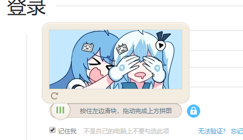
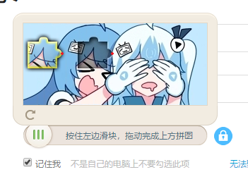
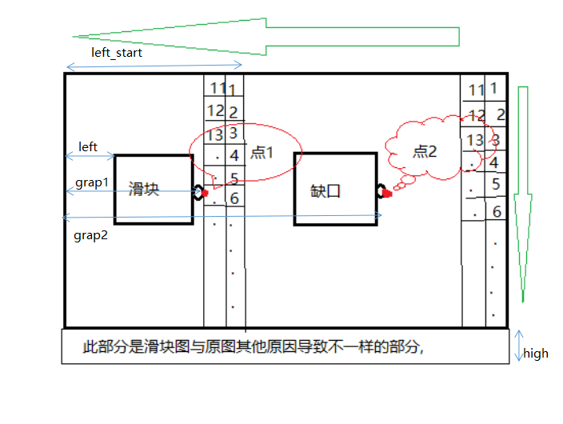

先上图


这就是本次破解的验证。本文在参考崔庆才老师的极验滑动块验证的基础上进一步精准破解

原理:

​	1.先获取到完整的图片

 

​	2.再获取到有滑块的图片



​	3.先将原图和有滑块的图进行像素对比,找到如图所标的两点位置;我采用的是从右向左找到右边点的位置,

然后从中间向左找到左边点的位置,然后计算出两点之间的距离,就知道滑块应该滑动距离。(一般情况下,就能准确的计算出精准的滑块与缺口的距离,当遇到最极端的情况,也就是滑块的左边没有凸起并且滑块与缺口是紧挨着的,这时我们可以采取从新请求页面的方式,这种情况很少,本人只遇到过一次),

   从下图可以详细的分析,

​	假如每个小方块就是一个像素点;

​	我们从最右边的像素点1开始对比像素点,再对比像素点2第一列对比完再对比第二列,直到找到点2的位置(grap2);

​	然后寻从中间(left_start)的像素点1开始对比,直至找到点1的位置(grap1);



​	4.为了模拟滑动,所以我们在滑动的时候也采用的是分段加速,分段减速的方式进行滑动。

具体代码实现:

```
import time
from io import BytesIO
from PIL import Image
from selenium import webdriver
from selenium.webdriver import ActionChains
from selenium.webdriver.common.by import By
from selenium.webdriver.support.ui import WebDriverWait
from selenium.webdriver.support import expected_conditions as EC

USER = '96588kh' # 用户名
PASSWORD = '965478685' # 密码


class CrackGeetest():

    def __init__(self):
        self.url = 'https://passport.bilibili.com/login'
        self.browser = webdriver.Chrome()
        self.wait =  WebDriverWait(self.browser, 10)
        self.email = USER
        self.password = PASSWORD

    def __del__(self):
        self.browser.close()

    def open(self):
        self.browser.get(self.url)
        email = self.wait.until(EC.presence_of_element_located((By.CSS_SELECTOR, '#login-username')))
        password = self.wait.until(EC.presence_of_element_located((By.CSS_SELECTOR, '#login-passwd')))
        email.send_keys(self.email)
        password.send_keys(self.password)

    def get_position(self, id):
        """
        获取验证码位置
        :return: 验证码位置元组
        """
        if id == 1:
            img = self.wait.until(EC.presence_of_element_located((By.XPATH, '//div[@id="gc-box"]//div[@class="gt_widget gt_clean gt_show"]')))
        else:
            img = self.wait.until(EC.presence_of_element_located((By.XPATH, '//div[@id="gc-box"]//div[@class="gt_widget gt_clean gt_show"]')))

        time.sleep(2)
        location = img.location
        size = img.size
        top, bottom, left, right = location['y'], location['y'] + size['height'], location['x'], location['x'] + size[
            'width']
        return (top, bottom, left, right)

    def get_screenshot(self):
        """
        获取网页截图
        :return: 截图对象
        """
        screenshot = self.browser.get_screenshot_as_png()
        screenshot = Image.open(BytesIO(screenshot))
        return screenshot

    def get_geetest_image(self, name='captcha.png', id=1):
        """
        获取验证码图片
        :return: 图片对象
        """
        top, bottom, left, right = self.get_position(id)
        print('验证码位置', top, bottom, left, right)
        screenshot = self.get_screenshot()
        captcha = screenshot.crop((left, top, right, bottom))
        captcha.save(name)
        return captcha

    def get_geetest_button(self):
        button = self.wait.until(EC.element_to_be_clickable((By.XPATH, '//div[@id="gc-box"]//div[@class="gt_guide_tip gt_show"]')))
        return button

    def get_slider(self):
        button = self.wait.until(EC.element_to_be_clickable((By.XPATH, '//div[@id="gc-box"]//div[@class="gt_slider_knob gt_show"]')))
        return button

    def is_pixel_equal(self, image1, image2, x, y):
        """
        判断两个像素是否相同
        :param image1: 图片1
        :param image2: 图片2
        :param x: 位置x
        :param y: 位置y
        :return: 像素是否相同
        """
        # 取两个图片的像素点
        pixel1 = image1.load()[x, y]
        pixel2 = image2.load()[x, y]
        threshold = 80
        # 比较像素点的RGB值,本文设置的差值在80以内,可以根据情况调整
        if abs(pixel1[0] - pixel2[0]) < threshold and abs(pixel1[1] - pixel2[1]) < threshold and abs(
                pixel1[2] - pixel2[2]) < threshold:
            return True
        else:
            return False


    def get_gap_1(self, image1, image2):
        """
        获取缺口偏移量
        :param image1: 不带缺口图片
        :param image2: 带缺口图片
        :return:
        """
        left = 15 # left 是图片左边多余不用进行对比的距离
        left_start = 70 # left_start 是当滑动右边有凸起时,凸起距离图片最左边的
        high = 37  # 图片下面多余不用进行对比的距离
        for i in range(left_start, 20, -1): 距离
            for j in range(image1.size[1] - high): 
                if not self.is_pixel_equal(image1, image2, i, j):
                    left = i
                    return left
        return left


    def get_gap_2(self, image1, image2):
        """
        获取缺口偏移量
        :param image1: 不带缺口图片
        :param image2: 带缺口图片
        :return:
        """
        left = 15 # left 是图片左边多余不用进行对比的距离
        high = 37  # 图片下面多余不用进行对比的距离
        for i in range(image1.size[0] - 1, left, -1):
            for j in range(image1.size[1] - high): 
                if not self.is_pixel_equal(image1, image2, i, j):
                    left = i
                    return left
        return left
        
        
    def get_track(self, distance):
        """
        根据偏移量获取移动轨迹
        :param distance: 偏移量
        :return: 移动轨迹
        """
        # 移动轨迹
        track = []
        # 当前位移
        current = 0
        # 减速阈值
        mid = distance * 4 / 5
        # 计算间隔
        t = 0.3
        # 初速度
        v = 0

        while current < distance:
            if current < mid:
                # 加速度为正2
                a = 2
            else:
                # 加速度为负2
                a = -2
            # 初速度v0
            v0 = v
            # 当前速度v = v0 + at
            v = v0 + a * t
            # 移动距离x = v0t + 1/2 * a * t^2
            move = v0 * t + 1 / 2 * a * t * t
            # 当前位移
            current += move
            # 加入轨迹
            track.append(round(move))
        return track

    # =============================================以上部分修改过

    def move_to_gap(self, slider, track):
        """
        拖动滑块到缺口处
        :param slider: 滑块
        :param track: 轨迹
        :return:
        """
        ActionChains(self.browser).click_and_hold(slider).perform()
        for x in track:
            ActionChains(self.browser).move_by_offset(xoffset=x, yoffset=0).perform()
        time.sleep(0.5)
        ActionChains(self.browser).release().perform()

    def crack(self):
        # 输入用户名密码
        self.open()
        # 点击验证按钮
        button = self.get_geetest_button()
        button.click()
        # 获取验证码图片
        image1 = self.get_geetest_image('captcha1.png', 1)
        # 点按呼出缺口
        slider = self.get_slider()
        slider.click()
        # 获取带缺口的验证码图片
        image2 = self.get_geetest_image('captcha2.png', 2)

        # 获取缺口1位置
        gap1 = self.get_gap_1(image1, image2)
        # 获取缺口2位置
        gap2 = self.get_gap_2(image1, image2)
        gap = gap2 - gap1
        print('缺口1位置', gap1)
        print('缺口2位置', gap2)
        print('缺口距离', gap)
        # 获取移动轨迹
        track = self.get_track(gap)
        print('滑动轨迹', track)
        # 拖动滑块
        self.move_to_gap(slider, track)


def main():
    crack = CrackGeetest()
    crack.crack()


if __name__ == '__main__':
    main()

```

