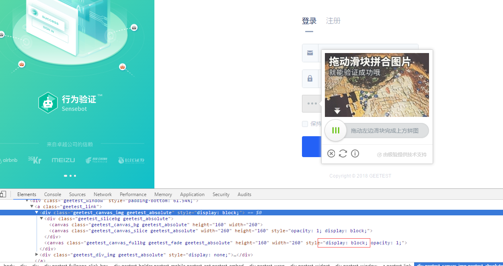

先上图


极验验证码是随机出现滑动块验证以及点击文字的位置和点击直接通过三种验证,

至于判断具体是那种验证,可以根据是否能获取到图片元素以及获取到的图片大小来判断是哪种验证即可。

对于点击直接通过的验证,本文就不叙述了,而滑动块的验证可以参考[滑动块验证](https://github.com/slystrong/spiders/tree/master/record/Slide_block_verification(bilibili).md ),但是极验有一点不一样,就是极验的原图我们在网页上看不到,本人后来在开发者模式里面查看网页时发现原图被隐藏了


,所以需要我们去将其显示出来



下面给出滑动源码:

```
import time

from io import BytesIO


from PIL import Image
from selenium import webdriver
from selenium.webdriver import ActionChains
from selenium.webdriver.common.by import By
from selenium.webdriver.support.ui import WebDriverWait
from selenium.webdriver.support import expected_conditions as EC

from utils.chaojiying import Chaojiying_Client

USER = 'okd'
PASSWORD = '56'


class CrackGeetest():

    def __init__(self):
        self.url = 'https://auth.geetest.com/login/'
        self.browser = webdriver.Chrome()
        self.browser.set_window_size(800, 800)
        self.wait = WebDriverWait(self.browser, 10)
        self.email = USER
        self.password = PASSWORD

    def __del__(self):
        self.browser.close()

    def get_x_y(self, name='captcha.jpg'):
        chaojiying = Chaojiying_Client('carmack', 'Vff635241', '96001')
        im = open(name, 'rb').read()
        position_str = chaojiying.PostPic(im, 9004)
        print(position_str)

    def open(self):
        self.browser.get(self.url)
        email = self.wait.until(EC.presence_of_element_located((By.XPATH, '//*[@id="base"]/div[2]/div/div/div[3]/div/form/div[1]/div/div/input')))
        password = self.wait.until(EC.presence_of_element_located((By.XPATH, '//*[@id="base"]/div[2]/div/div/div[3]/div/form/div[2]/div/div[1]/input')))
        email.send_keys(self.email)
        password.send_keys(self.password)

    def get_position(self, id=1):
        """
        获取验证码位置
        :return: 验证码位置元组
        """
        if id == 1:
            img = self.wait.until(EC.presence_of_element_located((By.XPATH, '/html/body/div[3]/div[2]/div[1]/div/div[1]/div[1]/div/a/div[1]/div/canvas[2]')))
        elif id == 2:
            self.browser.execute_script('document.getElementsByClassName("geetest_canvas_fullbg")[0].setAttribute("style", "display: block;opacity: 1;");')  # 设置原图可见
            img = self.wait.until(EC.presence_of_element_located((By.XPATH, '/html/body/div[3]/div[2]/div[1]/div/div[1]/div[1]/div/a/div[1]/canvas')))
        time.sleep(2)
        location = img.location
        size = img.size
        top, bottom, left, right = location['y'], location['y'] + size['height'], location['x'], location['x'] + size[
            'width']
        return (top, bottom, left, right)

    def get_screenshot(self):
        """
        获取网页截图
        :return: 截图对象
        """
        screenshot = self.browser.get_screenshot_as_png()
        screenshot = Image.open(BytesIO(screenshot))
        return screenshot

    def get_geetest_image(self, name='captcha.png', id=1):
        """
        获取验证码图片
        :return: 图片对象
        """
        top, bottom, left, right = self.get_position(id)
        print('验证码位置', top, bottom, left, right)
        screenshot = self.get_screenshot()
        captcha = screenshot.crop((left, top, right, bottom))
        captcha.save(name)
        return captcha

    def get_geetest_button(self):
        button = self.wait.until(EC.element_to_be_clickable((By.XPATH, '//*[@id="captchaIdLogin"]/div/div[2]/div[1]/div[3]')))
        return button

    def get_slider(self):
        button = self.wait.until(EC.element_to_be_clickable((By.XPATH, '/html/body/div[3]/div[2]/div[1]/div/div[1]/div[2]/div[2]')))
        return button

    def is_pixel_equal(self, image1, image2, x, y):
        """
        判断两个像素是否相同
        :param image1: 图片1
        :param image2: 图片2
        :param x: 位置x
        :param y: 位置y
        :return: 像素是否相同
        """
        # 取两个图片的像素点
        pixel1 = image1.load()[x, y]
        pixel2 = image2.load()[x, y]
        threshold = 80
        if abs(pixel1[0] - pixel2[0]) < threshold and abs(pixel1[1] - pixel2[1]) < threshold and abs(
                pixel1[2] - pixel2[2]) < threshold:
            return True
        else:
            return False

    def get_gap_1(self, image1, image2):
        """
        获取缺口偏移量
        :param image1: 不带缺口图片
        :param image2: 带缺口图片
        :return:
        """
        left = 15
        print(image1.size)
        for i in range(55, 20, -1):
            for j in range(image1.size[1] - 20):
                if not self.is_pixel_equal(image1, image2, i, j):
                    left = i
                    return left
        return left

    def get_gap_2(self, image1, image2):
        """
        获取缺口偏移量
        :param image1: 不带缺口图片
        :param image2: 带缺口图片
        :return:
        """
        left = 15
        for i in range(image1.size[0] - 1, left, -1):
            for j in range(image1.size[1] - 20):
                if not self.is_pixel_equal(image1, image2, i, j):
                    left = i
                    return left
        return left

   
    def get_track(self, distance):
        """
        根据偏移量获取移动轨迹
        :param distance: 偏移量
        :return: 移动轨迹
        """
        # 移动轨迹
        track = []
        # 当前位移
        current = 0
        # 减速阈值
        mid = distance * 4 / 5
        # 计算间隔
        t = 0.3
        # 初速度
        v = 0

        while current < distance:
            if current < mid:
                # 加速度为正2
                a = 2
            else:
                # 加速度为负3
                a = -2
            # 初速度v0
            v0 = v
            # 当前速度v = v0 + at
            v = v0 + a * t
            # 移动距离x = v0t + 1/2 * a * t^2
            move = v0 * t + 1 / 2 * a * t * t
            # 当前位移
            current += move
            # 加入轨迹
            track.append(round(move))
        return track

    def move_to_gap(self, slider, track):
        """
        拖动滑块到缺口处
        :param slider: 滑块
        :param track: 轨迹
        :return:
        """
        ActionChains(self.browser).click_and_hold(slider).perform()
        for x in track:
            ActionChains(self.browser).move_by_offset(xoffset=x, yoffset=0).perform()
        time.sleep(0.5)
        ActionChains(self.browser).release().perform()

    def crack(self):
        # 输入用户名密码
        self.open()
        # 点击验证按钮
        button = self.get_geetest_button()
        button.click()
        # 获取验证码图片
        image2 = self.get_geetest_image('captcha2.png', 1)
        image1 = self.get_geetest_image('captcha1.png', 2)

        # 获取缺口1位置
        gap1 = self.get_gap_1(image1, image2)
        # 获取缺口2位置
        gap2 = self.get_gap_2(image1, image2)
        gap = gap2 - gap1
        print('缺口1位置', gap1)
        print('缺口2位置', gap2)
        print('缺口距离', gap)
      
        # # 获取移动轨迹
        track = self.get_track(gap)
        print('滑动轨迹', track)
        # 点按呼出缺口
        slider = self.get_slider()
        # 拖动滑块
        self.move_to_gap(slider, track)

        success = self.wait.until(
            EC.text_to_be_present_in_element((By.XPATH,
                                              '// *[ @ id = "captchaIdLogin"] / div / div[2] / div[2] / div / div[2] / span[1]'),
                                             '验证成功'))
        print(success)

        # 失败后重试
        if not success:
            self.crack()
        else:
            time.sleep(20)
            self.login()


def main():
    crack = CrackGeetest()
    crack.crack()


if __name__ == '__main__':
    main()
```

点击文字验证方式,因为出现概率不高,所以待更新...