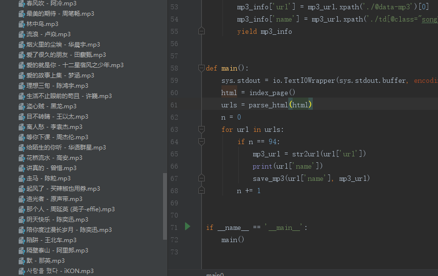

# 爬取虾米音乐

虾米排行榜:

保存的音乐截图:



本次爬取使用了selenium + lxml以及kaisa密码;

流程:

​	1.通过selenium 自动化通过Chrome浏览器访问虾米排行榜页面;

​	2.通过lxml找到列表音乐里面的每首歌所在的tr元素;

​	3.提取tr元素的data-mp3 属性值,此属性值就是歌曲的下载链接,不过是通过kaisa加密过的;

​	4.将属性值用kaisa解密,并保存;

​	5.获取tr元素下面的a元素;

​	6.a元素的文本内容就是音乐名字;

​	7.下载并保存音乐;

源码:

kaisa(

[kaisa]: (https://baike.baidu.com/item/%E6%81%BA%E6%92%92%E5%AF%86%E7%A0%81/4905284?fromtitle=%E5%87%AF%E6%92%92%E5%AF%86%E7%A0%81&amp;amp;amp;fromid=1336345&amp;amp;amp;fr=aladdin)

):

```
def str2url(s):
    num_loc = s.find('h')
    rows = int(s[0:num_loc])
    strlen = len(s) - num_loc
    cols = int(strlen/rows)
    right_rows = strlen % rows
    new_s = list(s[num_loc:])
    output = ''
    for i in range(len(new_s)):
        x = i % rows
        y = i / rows
        p = 0
        if x <= right_rows:
            p = x * (cols + 1) + y
        else:
            p = right_rows * (cols + 1) + (x - right_rows) * cols + y
        output += new_s[int(p)]
    return parse.unquote(output).replace('^', '0')
```

爬取音乐:

```
import io
import sys
from time import sleep
import requests
from selenium import webdriver
from lxml import etree
from selenium.common.exceptions import TimeoutException
from selenium.webdriver.common.by import By
from selenium.webdriver.support.wait import WebDriverWait
from selenium.webdriver.support import expected_conditions as EC

from utils.kaisa import str2url

# 调用Chrome浏览器
browser = webdriver.Chrome()
browser.set_window_size(600, 500)
wait = WebDriverWait(browser, 10)


# 保存MP3
def save_mp3(filename, url):
    data = requests.get(url)
    try:
        with open(r'mp3/' + filename + '.mp3', 'wb') as f:
            f.write(data.content)
    except IOError:
        print(filename + '下载失败!')


# 获取页面
def index_page():
    url = 'https://www.xiami.com/chart?spm=a1z1s.6843761.1110925385.2.LCqOyA'
    browser.get(url)
    try:
        wait.until(EC.presence_of_element_located((By.CSS_SELECTOR, '#chart')))
    except TimeoutException:
        index_page()
    for i in range(8):
        browser.execute_script('window.scrollBy(0, document.body.scrollHeight/8)')
        sleep(1)
    page_source = browser.page_source
    return page_source


# 解析页面
def parse_html(html):
    etree_html = etree.HTML(html)
    mp3_urls = etree_html.xpath('//div[@id="chart"]//tr[@class="songwrapper"]')
    for mp3_url in mp3_urls:
        mp3_info = {}
        # 获取kaisa加密过的音乐下载链接
        mp3_info['url'] = mp3_url.xpath('./@data-mp3')[0]
        # 获取音乐名
        mp3_info['name'] = mp3_url.xpath('./td[@class="songblock"]//div[@class="info"]//a/text()')[0]
        yield mp3_info


def main():
    html = index_page()
    urls = parse_html(html)
    for url in urls:
    	# 调用kaisa,解密
        mp3_url = str2url(url['url'])
        save_mp3(url['name'], mp3_url)


if __name__ == '__main__':
    main()

```

