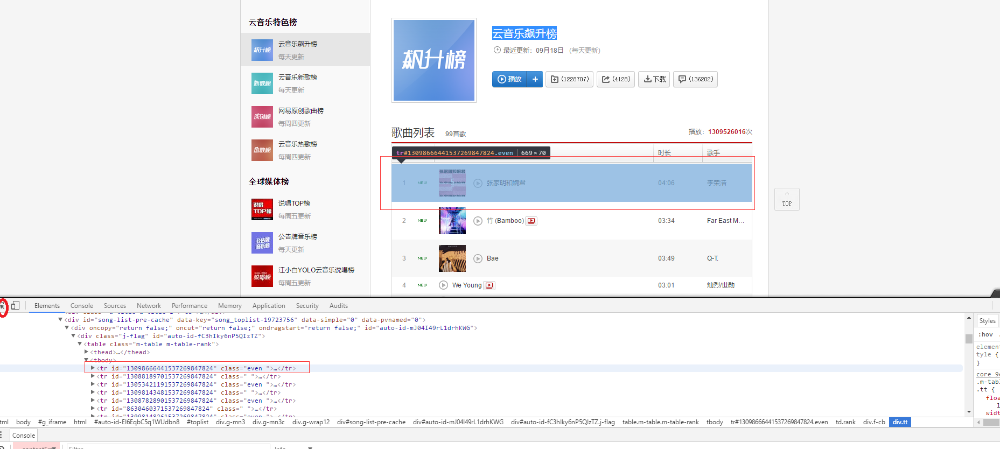
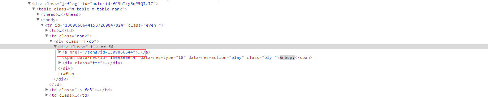
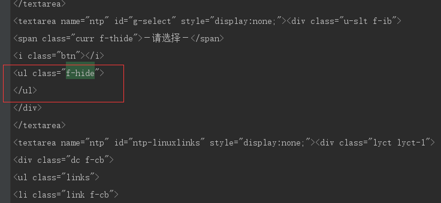
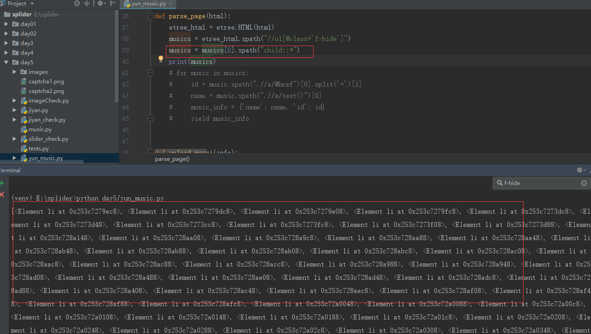
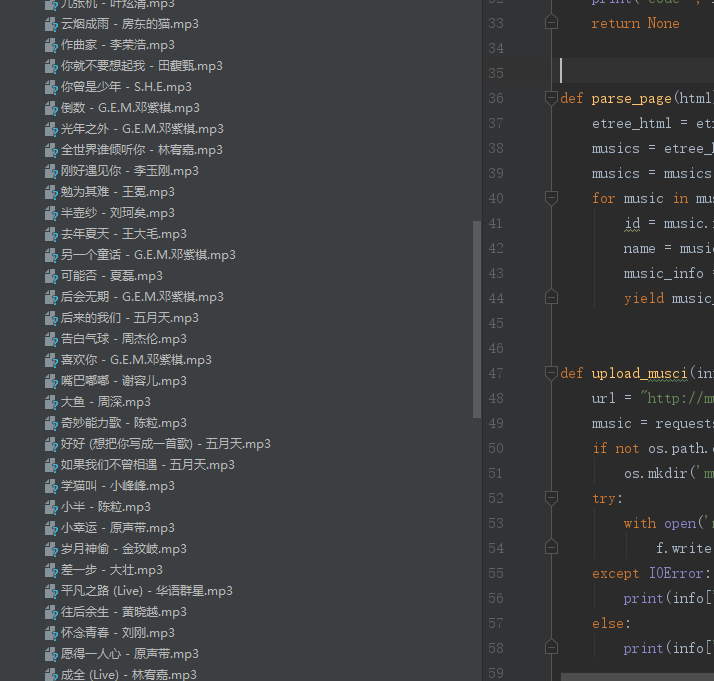

# 爬取网易云音乐

这次主要是爬取云音乐排行榜上的音乐， 以 '云音乐飙升榜' 为例:

首先,我们打开云音乐飙升榜的链接

[云音乐飙升榜]: https://music.163.com/#/discover/toplist?id=19723756

进入页面后,进入开发者模式



如图,我们用元素选择工具,很容易的获取到每首音乐就对应的一个tr标签,然后我们随便点开tr标签



注意看红框,很明显这就是这首音乐对应的id值。这样就好办了,只需要知道获取音乐的接口就可以将音乐保存下来。

本人从页面上分析了很久也没找到接口, 后来百度了一下,发现网上有云音乐的

[音乐api]: http://music.163.com/song/media/outer/url?id=

,以及网易云音乐其他一些api 

[网易云音乐API]: https://binaryify.github.io/NeteaseCloudMusicApi/#/?id=_2190-20180829

到目前为止,所有的准备工作就算完成了,接下来只需要将整个 '云音乐飙升榜'页面里面排行榜的音乐的id依次通过音乐api接口去获取音乐,再将音乐保存下来就OK了。

本人是通过XPATH获取元素,当然也可以使用其他的。

但是当用xpath(//*[@id="13098666441537269847824"]/td[2]/div/div/a)去获取那个具有音乐id的a元素时,却发现获取不到,返回的是空,后来各种分析加百度,以及用其他方式(bs4,正则)去获取元素,终于当用正则的时候获取到了a相关的字符串,然后本人将xpath和正则获取到的数据从最外面层一层一层对比,发现返回的页面中包含音乐信息那部分是空的,

```
musics = etree_html.xpath("//ul[@class='f-hide']")
# musics下面的内容为空
```



后来在网上找了些资料,发现可以通过正则去匹配这部分内容就能匹配出来。(下面的图片是本人后来xpath匹配的)



当我们获取到这部分内容时,获取音乐的id就可以按照正常步奏进行就可以了。

// 注意我们正常访问飙升榜的url是 https://music.163.com/#/discover/toplist?id=19723756

// 我们爬取时要将中间的#删去,否则通过正则也匹配不出来音乐信息那部分内容的

 // https://music.163.com/discover/toplist?id=19723756

整个代码如下:

```python
import os
import re
from time import sleep

import requests
from lxml import etree


def get_page():
	"""
	获取飙升榜页面  
	"""
	# 请求url
    url = 'https://music.163.com/discover/toplist?id=3778678'
    # 构造请求头, 可以按实际情况更改删减
    headers = {
        'Accept':'text/html,application/xhtml+xml,application/xml;q=0.9,image/webp,image/apng,*/*;q=0.8',
        'Accept-Encoding':'gzip, deflate',
        'Accept-Language':'zh-CN,zh;q=0.9',
        'Connection':'keep-alive',
        'Cookie':'_iuqxldmzr_=32; _ntes_nnid=142ffd9516e00513b9707328c29e0195,1521784704858; _ntes_nuid=142ffd9516e00513b9707328c29e0195; usertrack=ezq0plq3wOMQ34EHmPMAAg==; vjuids=-4fe770c38.1625deef87d.0.c7e007fc37d26; vjlast=1521994365.1521994365.30; vinfo_n_f_l_n3=d203e34a25baf465.1.0.1521994365067.0.1521994373977; __f_=1522052708376; nts_mail_user=71855459@163.com:-1:1; _ngd_tid=TFxsw5HJSdmxG9lcO7BDua0ZOT7ARpKo; P_INFO=71855459@163.com|1522470756|0|urs|11&6|hub&1522470505&mail163#hub&420100#10#0#0|&0|mail163|71855459@163.com; __utma=94650624.264254083.1522676515.1523435577.1523780359.6; __utmc=94650624; __utmz=94650624.1523780359.6.4.utmcsr=baidu|utmccn=(organic)|utmcmd=organic; WM_TID=%2FmmgDsapiTPWLMI1H4dIYKG34eF08h4h; JSESSIONID-WYYY=%2FATUbu32QDzHbV9nv%5CbTU0%2F%5CFDDuUiK2Gtm4R99xZY22R%2FuMxAiTEtqyfoQGXbG%2BOZGlqlt2rbwD8KHq47%2FXTF0P8d%5C7p17iYRMeBBnoNDkPpnyx0tAkck76ZzoODF0y1e8%5CTxUa1vVKZ94mdyUnvUB%2FJyjWAWvug9VcCvh7obm5e02P%3A1523783898525; __utmb=94650624.11.10.1523780359',
        'Host':'music.163.com',
        'Referer':'http://music.163.com/',
        'Upgrade-Insecure-Requests':'1',
        'User-Agent':'Mozilla/5.0 (Windows NT 6.1; WOW64) AppleWebKit/537.36 (KHTML, like Gecko) Chrome/64.0.3282.186 Safari/537.36'
    }
    response = requests.get(url, headers=headers)
    # 判断请求是否成功
    if response.status_code == 200:
        text = response.content.decode('utf-8')
        return response.text
    print('code=', response.status_code)
    return None


def parse_page(html):
	"""
	解析页面
	"""
    etree_html = etree.HTML(html)
    musics = etree_html.xpath("//ul[@class='f-hide']")
    musics = musics[0].xpath("child::*")
    for music in musics:
        id = music.xpath(".//a/@href")[0].split('=')[1] # 音乐id
        name = music.xpath(".//a/text()")[0] # 音乐名
        music_info = {'name': name, 'id': id} # 音乐信息
        yield music_info


def upload_musci(info):
    """
    下载音乐
    """
    url = "http://music.163.com/song/media/outer/url?id=" + info['id'] + ".mp3"
    music = requests.get(url)
    if not os.path.exists('musics'):
        os.mkdir('musics')
    try:
        with open('musics/' + info['name'] +'.mp3', 'wb') as f:
            f.write(music.content)
    except IOError:
        print(info['name'] + '下载失败')
    else:
        print(info['name'] + '下载成功')


def main():
    html = get_page()
    info_list = parse_page(html)
    n = 1
    for info in info_list:
        print('正在下载第%d首歌曲:%s' % (n, info['name']))
        upload_musci(info)
        n += 1


if __name__ == '__main__':
    main()
```

下载成功的音乐列表截图:




